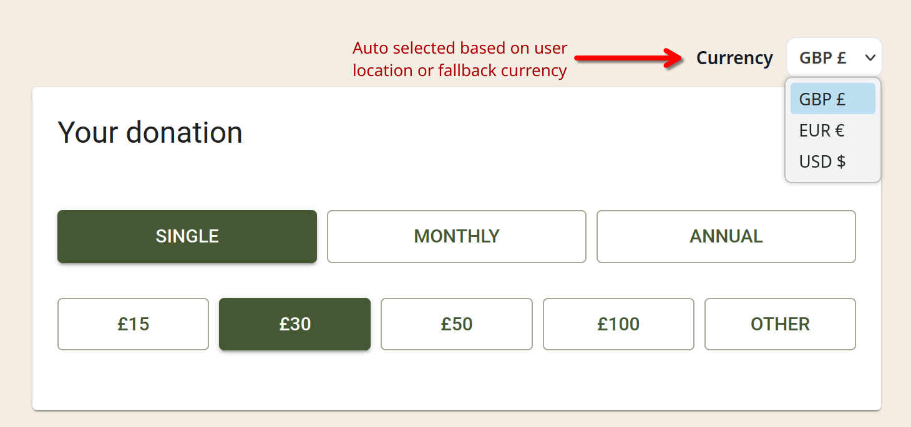
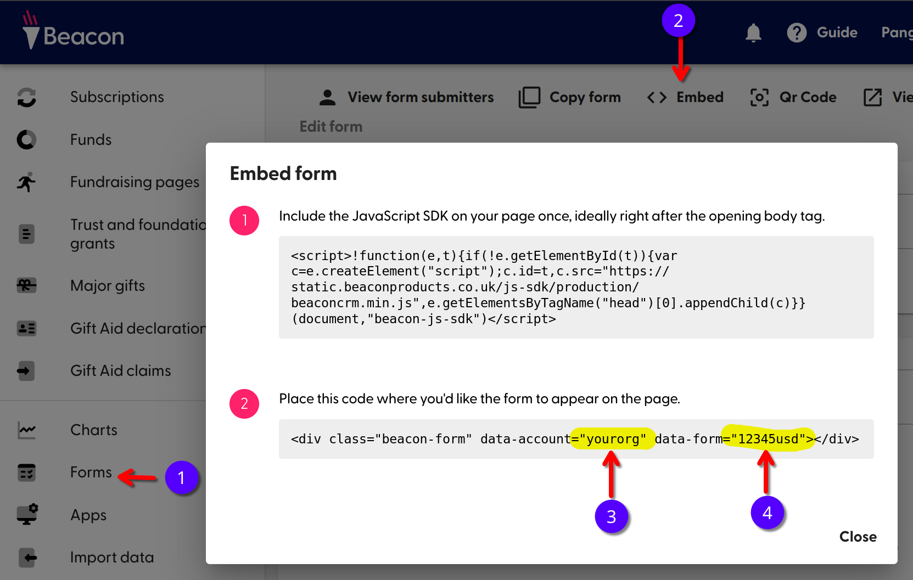
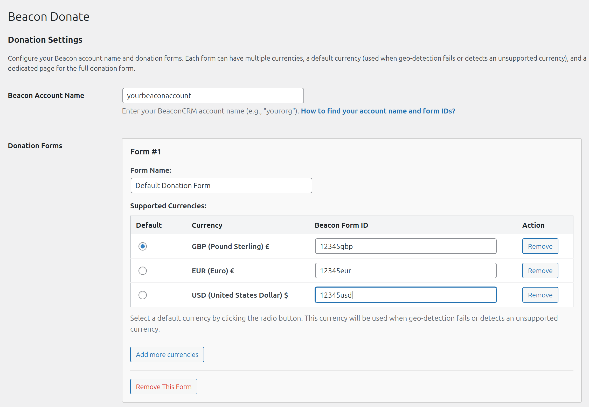
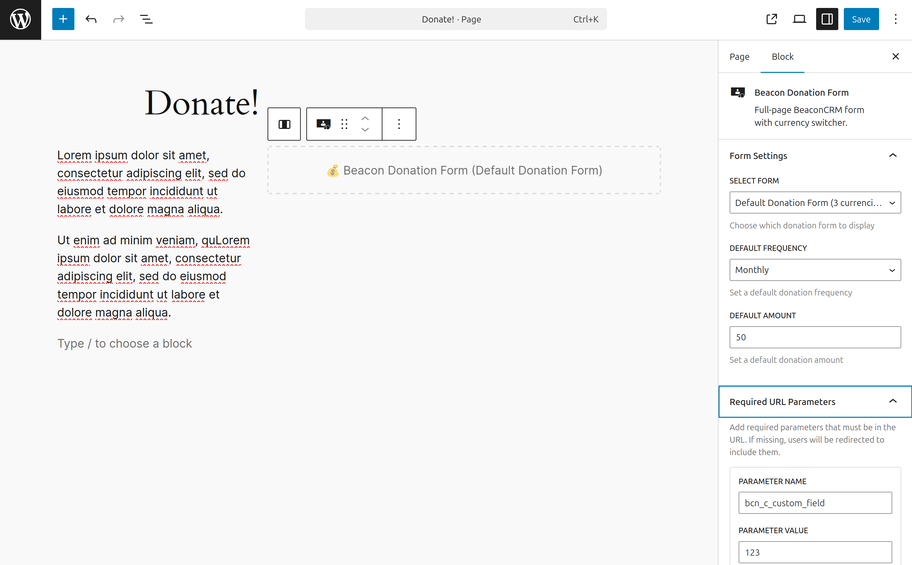

# Beacon Multi-Currency Forms

WordPress plugin for embedding BeaconCRM donation forms with multi-currency support, automatic geo-location detection, and UTM tracking.

**Key Features:**
- Multi-currency donation forms with automatic geo-detection
- Two display modes: full-page form and compact CTA box
- Works with Gutenberg (Block Editor), Elementor, Divi, and shortcodes
- UTM parameter tracking (180-day cookie persistence)
- Customizable colors, text, and preset amounts

**Requirements:**
- WordPress 6.0+ (tested on Wordpress v6.8.3)
- PHP 7.4+ (tested on PHP v8.1)
- BeaconCRM account

---

## 1. Overview

This plugin integrates BeaconCRM donation forms into WordPress. Display donation forms on dedicated pages or compact donation boxes in sidebars and content areas. Each form supports multiple currencies with automatic detection based on visitor location.



---

## 2. Essential Setup (3 Steps)

### Step 1: Install & Activate

Upload to `/wp-content/plugins/` and activate through WordPress admin.

> TODO: Publish to Wordpress Plugin Directory

### Step 2: Configure Account

Go to **Settings → Beacon Multi-Currency Forms**.


**Beacon Account Name:**
- Find this in your BeaconCRM embed code: `data-account="yourorg"`
- Enter just the account name (e.g., `yourorg`)

### Step 3: Add Your First Form




**In the Donation Forms section:**
1. **Form Name:** e.g., "General Donations"
2. **Target Page:** Select the page where visitors will complete donations (optional)
3. **Add Currencies:** Select currency and enter Beacon Form ID
   - Find Form ID in BeaconCRM embed code: `data-form="f0rm1d"`
   - Repeat for each currency you support
4. **Set Default Currency:** Click radio button next to one currency
5. **Save Settings**



**That's it!** You're ready to add donation forms to your pages.

---

## 3. Adding Donation Forms to Pages

### Gutenberg (Block Editor)

The WordPress Block Editor (formerly called Gutenberg) provides visual controls for both donation modules.

**Full Donation Form:**
1. Edit page → Click **(+)** Add block
2. Search **"Beacon Donation Form"**
3. Select your form from dropdown
4. **Optional Settings:**
   - **Custom Parameters:** Pass data to BeaconCRM (e.g., campaign tracking)
   - **Required URL Parameters:** Force specific URL params - redirects users if missing

**Donation Box (CTA):**
1. Edit page/post → Click **(+)** Add block  
2. Search **"Beacon Donation Box"**
3. **Configure in sidebar:**
   - Select donation form
   - Customize title, subtitle, button text
   - Set colors (primary/brand)
   - Add custom parameters
   - Control frequencies (single/monthly/annual)
   - Set preset amounts per frequency



**Widget Areas:**
The Donation Box block works in widget areas (sidebars, footers). Go to **Appearance → Widgets** and add the "Beacon Donation Box" block to any widget area.

### Shortcodes

Perfect for Classic Editor, widgets, or theme files.

#### Full Donation Form

**Basic:**
```
[beacon_donate_form]
```

**With Form Selection:**
```
[beacon_donate_form form="General Donations"]
```

**With Required URL Parameters:**
```
[beacon_donate_form form="Emergency Relief" params="bcn_c_adopted_animal=12345&bcn_custom=abc"]
```
Visitors without these exact URL parameters will be automatically redirected.

**In Theme Files:**
```php
<?php echo do_shortcode('[beacon_donate_form form="General Donations"]'); ?>
```

---

#### Donation Box

**Basic:**
```
[beacon_donate_box form="Default Donation Form"]
```

**With Form & Customization:**
```
[beacon_donate_box form="Emergency Relief" title="Support Our Cause" button_text="Give Now"]
```

**With Colors:**
```
[beacon_donate_box primary_color="#FF5733" brand_color="#2C3E50"]
```

**With Custom Parameters:**
```
[beacon_donate_box params="bcn_c_adopted_animal=12345&source=newsletter"]
```

**With Frequency Control:**
```
[beacon_donate_box frequencies="monthly,annual"]
```

**With Preset Amounts:**
```
[beacon_donate_box 
    presets_single="10,20,30"
    presets_monthly="5,10,15"
    presets_annual="50,100,200"
]
```

**Complete Example:**
```
[beacon_donate_box 
    form="Elephant Adoption"
    title="Adopt an Elephant"
    subtitle="Support conservation efforts"
    button_text="Adopt Now"
    notice="Your adoption helps protect endangered elephants"
    primary_color="#34D399"
    brand_color="#10B981"
    params="bcn_c_campaign=spring2025"
    frequencies="monthly,annual"
    presets_monthly="25,50,100"
    presets_annual="100,250,500"
]
```

**In Theme Files:**
```php
<?php echo do_shortcode('[beacon_donate_box form="Monthly Giving"]'); ?>
```

**All Shortcode Parameters:**
- `form` - Donation form name to use
- `title` - Main heading text
- `subtitle` - Subheading text  
- `notice` - Security/info message
- `button_text` - Donate button text (default: "Donate now →")
- `params` - Custom URL parameters (URL-encoded: `key1=value1&key2=value2`)
- `frequencies` - Allowed frequencies: `single`, `monthly`, `annual` (comma-separated)
- `presets_single` - Single donation amounts (comma-separated)
- `presets_monthly` - Monthly donation amounts (comma-separated)
- `presets_annual` - Annual donation amounts (comma-separated)
- `primary_color` - Button color (hex code)
- `brand_color` - Tabs/links color (hex code)

**Note:** Preset amounts, frequencies, and colors are fallback defaults. BeaconCRM API values override these when loaded.

### Elementor

Search widgets panel for:
- "Beacon Donation Form"
- "Beacon Donation Box"

Drag to your layout and configure in widget settings.

### Divi

Add module → Search for:
- "Beacon Donation Form"
- "Beacon Donation Box"

Configure in module settings.

---

## 4. Advanced: Multi-Currency & Geo-Location

### Automatic Currency Detection

Install the **[GeoIP Detection](https://wordpress.org/plugins/geoip-detect/)** plugin for automatic currency selection based on visitor location.

**Setup:**
1. Install and activate GeoIP Detection
2. Go to **Settings → Geolocation IP Detection**
3. Select `Maxmind GeoIP Lite City (Automatic download & update)`
4. Get your [free MaxMind license key](https://www.maxmind.com/en/geolite2/signup)
5. Enable **"JavaScript API"** option
6. Save settings

**How it works:**
- Visitor arrives → plugin detects country → selects matching currency
- If currency not supported or detection fails → uses default currency


### Multiple Forms

Create separate forms for different campaigns:

**Example:**
- Form 1: "General Donations" (USD, EUR, GBP)
- Form 2: "Emergency Relief" (USD, CAD, AUD)
- Form 3: "Monthly Giving" (USD, EUR)

Each form can have its own currencies and default currency.

---

## 5. Advanced: UTM Campaign Tracking

Track campaign parameters and pass them to donation forms.

### Enable Tracking

In **Settings → Beacon Multi-Currency Forms**:

**1. Load Beacon JavaScript globally** (optional)
- Loads Beacon SDK on all pages for cross-domain attribution
- [Learn about Beacon tracking](https://guide.beaconcrm.org/en/articles/5720151-tracking-forms-with-google-analytics#h_13617763bc)

**2. Enable UTM parameter tracking** (optional)
- Tracks `utm_source`, `utm_medium`, `utm_campaign` in 180-day cookie
- Automatically passes to donation forms
- Configure custom parameter names (default: `bcn_pay_c_utm_source`, etc.)


### How It Works

```
User clicks link: ?utm_source=facebook&utm_medium=social&utm_campaign=march2025
↓
Cookie stores parameters (180 days)
↓
User visits donation page (days/weeks later)
↓
Parameters automatically passed to BeaconCRM form
```

**Cookie behavior:**
- Only updates when `utm_source` is present (prevents partial data)
- Works with page caching (JavaScript-based)

---

## 6. Troubleshooting

### Form Not Displaying

**Check:**
- Beacon Account Name is correct (no typos)
- Form IDs are correct (6-12 alphanumeric characters)
- At least one currency added to the form
- Check browser console for JavaScript errors

### Wrong Currency Showing

**Solutions:**
- Install GeoIP Detection plugin for auto-detection
- Verify default currency is set (radio button selected)
- Clear site and browser cache

### Custom Parameters Not Working

**Check:**
- Parameter names must start with `bcn_` for BeaconCRM custom fields
- URL-encode special characters in shortcodes
- Verify parameters in browser URL when form redirects

### Styling Issues

The plugin inherits your theme's styles. Override with custom CSS:

**Add to Appearance → Customize → Additional CSS:**
```css
/* Change button color */
.bmcf-btn {
  background-color: #your-color !important;
}

/* Change card appearance */
.bmcf-card {
  border-radius: 8px;
  box-shadow: 0 2px 8px rgba(0,0,0,0.1);
}

/* Change text color */
.bmcf-wrap {
  color: #333;
}
```

**Common CSS Classes:**
- `.bmcf-wrap` - Main container
- `.bmcf-card` - Donation box card
- `.bmcf-btn` - Buttons
- `.bmcf-select` - Dropdowns
- `.bmcf-tab` - Frequency/amount buttons

**CSS Variables:**
- `--bmcf-primary` - Primary button color
- `--bmcf-brand` - Brand color for tabs/links
- `--bmcf-text` - Text color
- `--bmcf-border` - Border color

---

## Credits

**Author:** Amer Kawar @ [WildAmer.com](https://wildamer.com)  
**License:** GPLv3

### Changelog

**0.1.3**
- More consistent naming (bmcf).
- Elementor bug fix with styling issues.

**0.1.2**
- Multi-currency support with geo-location detection
- UTM parameter tracking (180-day persistence)
- Gutenberg blocks, Elementor widgets, Divi modules
- Customizable colors, text, and preset amounts